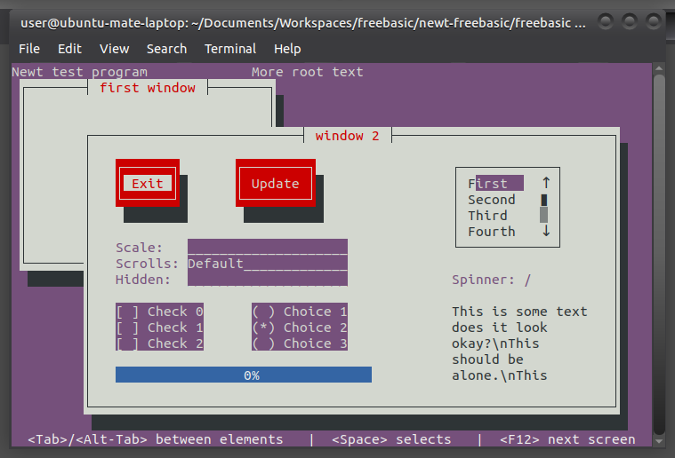

# newt-freebasic

The newt windowing system is a terminal-based (TUI) window and widget library designed for writing applications with a simple, but user-friendly, interface.

libnewt.a is the library and newt.bi is the header for freebasic projects.

## Installation

You can copy libnewt.a to the folder of your bas file or install libnewt-dev.deb for your Debian/Ubuntu operating system.

## Examples - Tutorial

There is Erik's Troan tutorial in libnewt-dev/tutorial.html folder.

There are many freebasic examples in freebasic examples folder.

Special thanks to **Angelo Rosina** aka **angros47** who translate three c examples to freebasic (testtree.bas, testgrid.bas, test.bas)

Special thanks also to **SARG** who helped me at the begining of translating newt.h with fbfrog app and for trying to build libnewt.a for windows.

## Notes

This version of libnewt.a works only for linux 64 bit.

Together with **SARG** tried to make it work for windows but we have no success.

## Screenshots

newt provides TUI widgets for linux terminal apps. Here is an example screenshot

